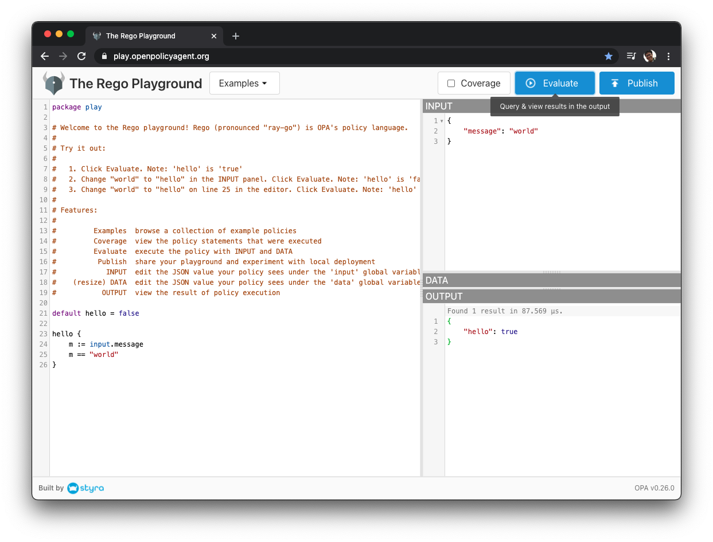
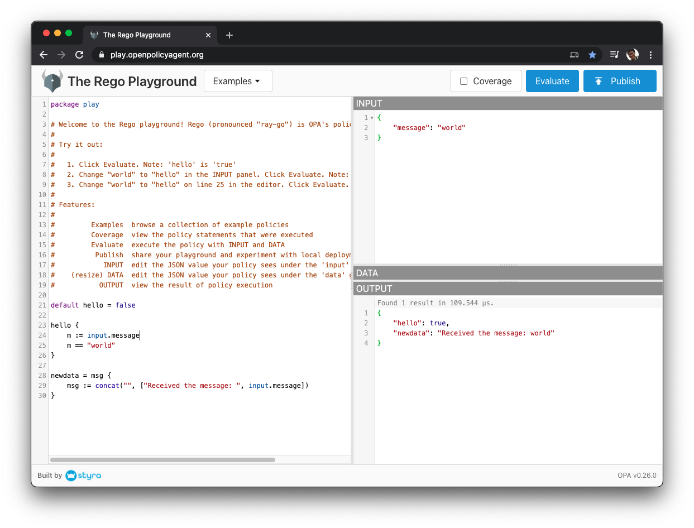
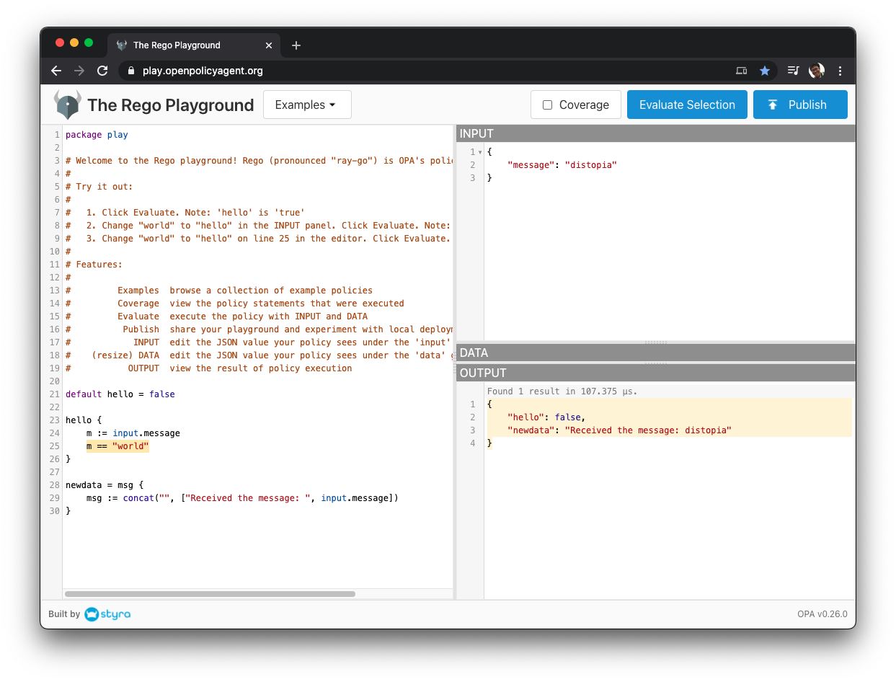
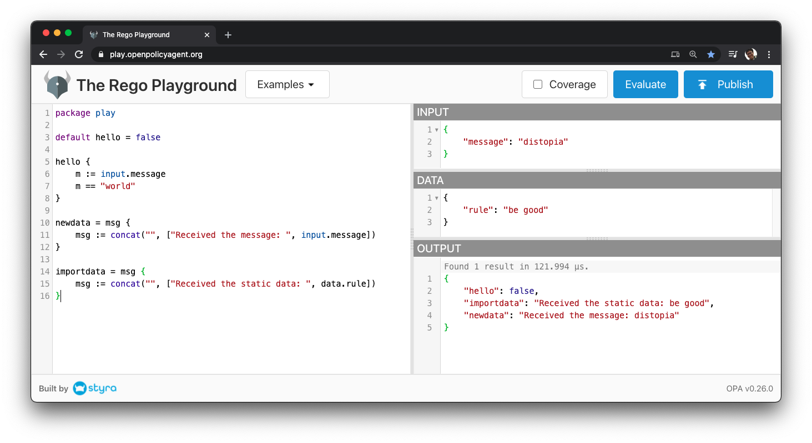
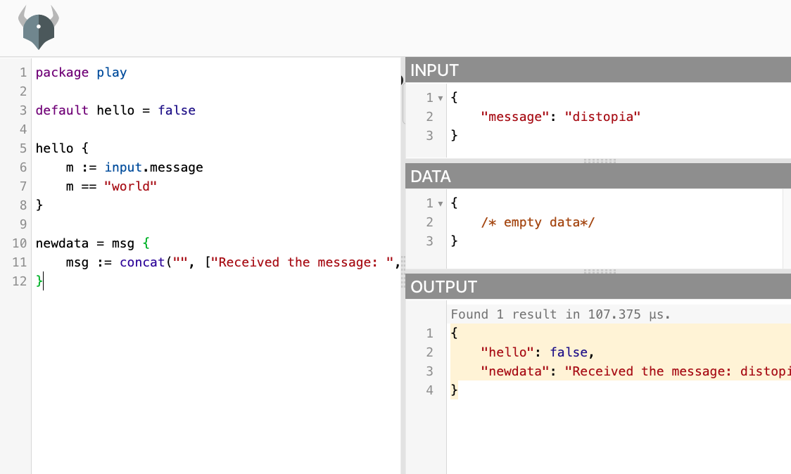

# Open Policy Agent (OPA): Up and Running

Copyright: Hiro Osaki 2021

<!-- vscode-markdown-toc -->
* 1. [Your first coding at least cost: Try Rego Playground](#Yourfirstcodingatleastcost:TryRegoPlayground)
	* 1.1. [Walkthrough (5 min)](#Walkthrough5min)
	* 1.2. [What OPA does (3 min)](#WhatOPAdoes3min)
* 2. [Run OPA on your environment](#RunOPAonyourenvironment)
	* 2.1. [Install OPA (~ 5 min)](#InstallOPA5min)
	* 2.2. [Check OPA runs (5 min)](#CheckOPAruns5min)
	* 2.3. [Run OPA as server (5 min)](#RunOPAasserver5min)
	* 2.4. [Run OPA server with loading data (5 min)](#RunOPAserverwithloadingdata5min)
	* 2.5. [What OPA server does (3 min)](#WhatOPAserverdoes3min)
* 3. [Reference](#Reference)

<!-- vscode-markdown-toc-config
	numbering=true
	autoSave=true
	/vscode-markdown-toc-config -->
<!-- /vscode-markdown-toc -->

This document is for those who wants to use [Open Policy Agent (OPA)](https://www.openpolicyagent.org/) once. 

The fastest way takes 8 min.

##  1. <a name='Yourfirstcodingatleastcost:TryRegoPlayground'></a>Your first coding at least cost: Try Rego Playground

You can grasp what OPA is without using actual OPA. This is the fastest way to try OPA. The way is ["Rego Playground"](https://play.openpolicyagent.org/), by courtesy of [Styra](styra.com).

###  1.1. <a name='Walkthrough5min'></a>Walkthrough (5 min)

- Access https://play.openpolicyagent.org/
- Click `Evaluate` button.

  

- Try your first **Rego language** coding. Add these lines into the last of left pane.

  ```
  newdata = msg {
    msg := concat("", ["Received the message: ", input.message])
  }
  ```

  These lines mean that you want to generate a new data named `newdata`.

- Click `Evaluate` again.
  
  You will see the new result `newdata` is added in `OUTPUT` pane.

  

  The result is like this.
  ```
  {
    "hello": true,
    "newdata": "Received the message: world"
  }
  ```

  The second line `"newdata": ...` is your result. Other than this, `"hello"` is the result from existing code `hello {...}`

- Change `input`
  - You see `"message":...` in `INPUT` pane.
  - Change the message content to `"message": "distopia"`
  - Click `Evaluate` again. You will get the new result like this.
    ```
    {
        "hello": false,
        "newdata": "Received the message: distopia"
    }
    ```
    
  - Look at the `hello` result. The result changed from `true` to `false`. Here is why. 
    
    `hello` says `m == "world"`. 
    
    This means that if `message` is `"world"`, it retuns `true`. 
    
    Otherwise, it returns `false`.

- Change `data`
  - Insert the line into `data` pane.
    ```
    {
      "rule": "be good"
    }
    ```
  - Add the lines at the last of left pane.
    ```
    importdata = msg {
      msg := concat("", ["Received the static data: ", data.rule])
    }
    ```
  - Click `Evaluate` again
    
  - The result shows the following new line.

    ```
    "importdata": "Received the static data: be good",
    ```

###  1.2. <a name='WhatOPAdoes3min'></a>What OPA does (3 min)

- You see what OPA does in Rego Playground.
  
  1. **OPA understands some policy files**.<br/> The policy file is like `newdata = msg {...}` written in Rego language. (Left pane in Playground)
  2. **OPA receives `input`**.<br/> The `input` must be in JSON format. (Right-top pane in Playground)
  3. **OPA receives `data` too**.<br/> The `data` must be in JSON format too.  (Right-middle pane in Playground. `data` in the above example is empty JSON object `{}`)
  4. **OPA does calculation and generates `output`.**<br/> The `output` is also JSON format. (Right-bottom pane in Playground)
- Summary: OPA reads Rego file and 2 JSON objects. Then OPA generates JSON output.

- The details are in the official `introduction` document https://www.openpolicyagent.org/docs/latest/.

##  2. <a name='RunOPAonyourenvironment'></a>Run OPA on your environment

###  2.1. <a name='InstallOPA5min'></a>Install OPA (~ 5 min)

- For MacOS, simply run this command.

  ```sh
  brew install opa
  ```
- For other environments, install `opa` commands as the following document says.
  - https://www.openpolicyagent.org/docs/latest/#running-opa

###  2.2. <a name='CheckOPAruns5min'></a>Check OPA runs (5 min)

- Test OPA by running `opa run`

  ```sh
  $ opa run
  ```

  Also you can execute commands like `a = 3` or `exit` to exit.

  ```sh
  $ opa run
  OPA 0.26.0 (commit , built at )

  Run 'help' to see a list of commands and check for updates.

  > a = 3
  Rule 'a' defined in package repl. Type 'show' to see rules.
  > x = 3
  Rule 'x' defined in package repl. Type 'show' to see rules.
  > show
  package repl

  a = 3

  x = 3
  > exit
  ```

###  2.3. <a name='RunOPAasserver5min'></a>Run OPA as server (5 min)

- Save a file `example.rego`

  ```sh
  mkdir example/
  cd example/
  # create example.rego
  ```

  ```rego
  package play

  default hello = false

  hello {
      m := input.message
      m == "world"
  }

  newdata = msg {
      msg := concat("", ["Received the message: ", input.message])
  }

  importdata = msg {
      msg := concat("", ["Received the static data: ", data.rule])
  }
  ```

  ```sh
  # create input.json
  ```

  ```json
  {
    "input": {
      "message": "world"
    }
  }
  ```

  The above example is exactly same as section 1.1.

- Run the command

  ```sh
  opa run -s ./example.rego
  ```

- Send an request to OPA server
  - `/v1/data/play`

  ```sh
  $ curl localhost:8181/v1/data/play -i -d @input.json -H 'Content-Type: application/json'

  {"result":{"hello":true,"newdata":"Received the message: world"}}

  ```

  - `/v1/data/play/hello`

  ```sh
  $ curl localhost:8181/v1/data/play/hello -i -d @input.json -H 'Content-Type: application/json'

  {"result":true}
  # Same as the value of "hello" in section 1.1
  ```

  - `/v1/data/play/newdata`

  ```sh
  $ curl localhost:8181/v1/data/play/newdata -i -d @input.json -H 'Content-Type: application/json'

  {"result":"Received the message: world"}
  # Same as the value of "newdata" in section 1.1
  ```

  - `/v1/data/play/importdata`

  ```sh
  $ curl localhost:8181/v1/data/play/importdata -i -d @input.json -H 'Content-Type: application/json'

  {}
  # This is undefined because no data is imported.
  ```

###  2.4. <a name='RunOPAserverwithloadingdata5min'></a>Run OPA server with loading data (5 min)

  ```sh
  # create data.json
  ```

  ```json
  {
    "rule": "be good"
  }
  ```

  ```sh
  # add ./data.json to command arguments
  opa run -s ./example.rego ./data.json
  ```

- Send an request to OPA server
  - `/v1/data/play`

  ```sh
  $ curl localhost:8181/v1/data/play -i -d @input.json -H 'Content-Type: application/json'

  {"result":{"hello":true,"importdata":"Received the static data: be good","newdata":"Received the message: world"}}
  # Field "importdata" was added.
  ```

  - `/v1/data/play/importdata`
  ```sh
  $ curl localhost:8181/v1/data/play/importdata -i -d @input.json -H 'Content-Type: application/json'

  {"result":"Received the static data: be good"}
  # Data was added. Same as the value of "importdata" in section 1.1
  ```

###  2.5. <a name='WhatOPAserverdoes3min'></a>What OPA server does (3 min)

- OPA server runs on your environment and waits for HTTP requests
  - HTTP request should have JSON body. 
  - The body should be in the form of  `{"input": ***}`.
- OPA server has endpoints `<server>/v1/api/data/<package name>[/<object name>]`.
  - The first line of rego file `package play` declares that `<package name>` is `play`.
  - A object declaration `hello {...}` in rego file means that `<object name>` is `hello`.
- OPA's return value is JSON in the form of `{"result": ***}`.
  - Return values are varied by the requested endpoints.
    - If `<package name>` is requested, response includes all objects.
    - If `<package name>/<object name>` is requested, response includes one object output in `"result"` field.

##  3. <a name='Reference'></a>Reference

- Rego Playground: https://play.openpolicyagent.org/
- Github `OPA` repository: https://github.com/open-policy-agent/opa
